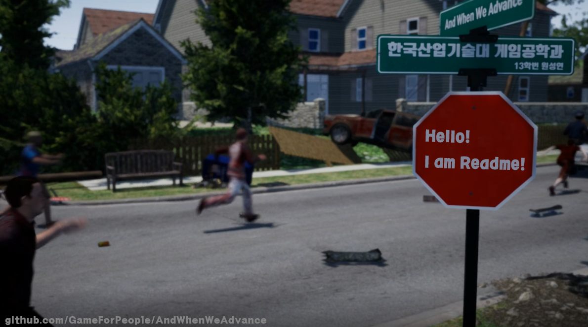

Project AndWhenWeAdvance
=====

__Welcome to the Project AndWhenWeAdvance Repository!__

>This project, Created with ___Unreal Engine 4___, is a ___one person development project___ about  ___open world___, ___zombie___, ___TPS genre game___.
And it is also a graduation piece of the ___Korea Polytechnic University's Game Engineering Department___.

> <- Click to watch the video.:)

about New Tech
--------
__Four new technologies were developed and applied to this project.__
>1. ___Real-time Object Tracing___ to adjust free Running
>2. ___Multi Channel Space partitioning___ to process openworld
>3. Advanced LOD : ___Optimization of massive dynamic objects___
>4. 3rd ___Metafiction Storytelling___ in game

about Tools
-----
__This project is being created using various software.__

>___Programming___
>* main : Unreal Engine 4 (4.18 ver)
>* sub : Visual Studio 2017

>___ART___
>* Modeling  : Fuse CC, 3D Max 
>* Animation : Mixamo, Maya 2018
>* Texture   : Photoshop CS 6
>* and MarketPlace...ha ha

>___SCM___
>* VCS : Github
>* Planning : Trello, Excel

about License
--------
__Please understand that this project has been under commercialization.__
>Unfortunately, you can not see the latest code files for this project in this repository.

Thanks for Whatching!
-----
>2018-05-26
>Game For People _Design Order_ ___Won Seong-Yeon___

* If you want to contact me : [GoMyHomepage][1]

* If you want to check the progress of the project : [GoMyTrello][2]

* If you want to see the video related to the project : [GoMyYoutube][3]

* If you want to check more about my profile : [GoMyFacebook][4]

[1]:https://koreagamemaker.wixsite.com/gameforpeople
[2]:https://trello.com/b/oGRwlV5t/and-when-we-advance
[3]:https://www.youtube.com/channel%2FUCnvRbN5eIixfxbMmJyiskDw%3Fview_as%3Dsubscriber
[4]:https://www.facebook.com/KoreaGameMaker
